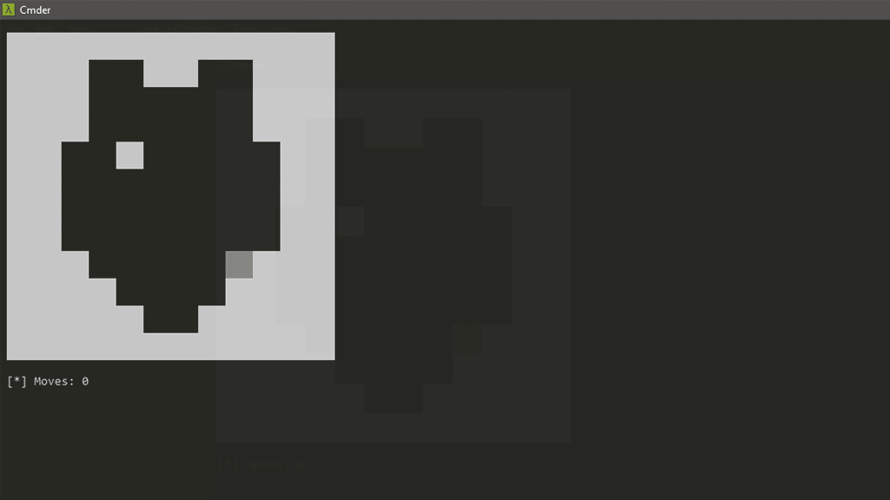

# LineGame Puzzle v0.01

## Description
This puzzle game starts with a .txt file containing the map and parses it so
that it works for the game. From there, control is passed onto the player. In
this state, a player may use the WASD keys to move up, left, down, and right,
respectively. Once a direction is chosen, the player's on-screen charater will
continue to move in the direction they chose until the character hits a
boundary wall. The amount of moves a player attempts to make is tracked and as
such, the player is encouraged to complete the puzzles in as few moves as
possible.

## Maps
Currently only one demo map is provided with the game. Users are encouraged to
make their own maps, however. If you plan to make your own map, please keep the
following in mind:
* Maps cannot have a length bigger than 12x12
* Maps must have boundaries surround them
* Boundaries are denoted by a pound sign, '#', and empty space by a period, '.'
* Maps must be solvable, meaning that all spaces must be able to be filled
  * Ex. If the demo map did not have the extra boundary in the middle, the map
    would be impossible to solve. Please test your maps.
* You currently must edit the .py file to include:
  * Link to file as an argument to `open()`
  * The start position must be changed, as the default is in (0, 0), which
    should be a boundary pixel. Please also keep in mind that the coordinate
    system uses (y, x).

## Contact
Check out [my website](https://www.joshuaibrom.com),
<https://www.joshuaibrom.com> to reach me! I'm also
[on Twitter](https://twitter.com/FizzedMr).

## Changelog
---
**Version 0.01**

* Created the game.
* Included default map and associated code.

## ToDo
---
- [ ] Add Linux support
- [ ] Add support for larger maps
- [ ] Add menu to select different maps
- [ ] Add scoreboard
- [ ] Possibly add feature to create custom map from in game
- [ ] Possible allow randomly-generated maps